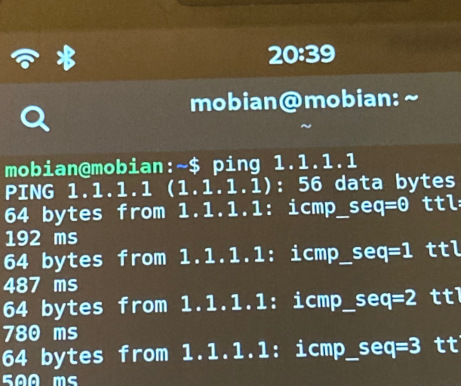

# Bugs:

Note this is for my current test phone which is old revision 1.1 Braveheart!

0. The mute button doesn't work in calls, they will still hear you! (After update of modem sdk or random?)

1. ~~Sometimes sound stops working (both speakers and headphones). Why? _Sometimes_ it is fixed by rebooting, _sometimes_ it is fixed by issuing `systemctl --user restart pulseaudio`. Hardware issue, bad connection? Also sometimes playing music is buggy, and pauses etc. related?~~  Some issues are solved by using PipeWire instead of PulseAudio. Still, music often pauses or interrupts when headphone cord is pulled a little, this is annoying.

2. ~~Sometimes when wake from suspend? And if you manually turn off mobile data or mobile network, often when turned on internet does not work. Sometimes no data, sometimes neither data or cellular. Setting Network gives error, "Cannot register modem: modem is c..." and changing Network Mode says "Transaction timed out" _or_ "Setting allowed modes not supported". Restarting ModemManager or NetworkManager does not help. Is there a solution? (usually cellular looks to work "4G", but no internet)~~ Should be ok with modem sdk and new firmware. Although, sometimes cellular shows coverage but a red exclamation mark. Go to mobile network in settings and turn off and on mobile internet (but not whole mobile network).

3. Wifi off switch doesn't _really_ work! If I turn it off when running, I still have internet (yes it was routing via wifi) and bluetooth. It worked to disable wifi before, as I recall, but now I tried twice and it just keeps going. If I turn it off before booting, it remains off however. (But evidently it still has connection and power?) \
 \
(the ping is not 780 ms but like 30.780 ms, bad pic)

4. Issue making calls on bad coverage? Try more 4G calls. Call quality is not perfect with some weird noise, but no major issues.

5. Sometimes/rarily (?) it seems dead, cannot wake from suspend or screen blank? Maybe when it's doing a lot in the background? Sometimes it is resolved by waiting a minute, but when working again all apps are killed. Perhaps Wayland just crashed?

## Rare bugs

1. Very rarely on new boot the top drag-down menu doesn't work. Fixed by locking phone.

# Feature Questions/Requests

0. Sometimes blue light is blinking but I'm not sure why (I see no notifications on screen)! Still it works, including for Signal-desktop notifications.
1. Import/export contacts from SIM card? (contacts can be handled via .vcf file instead)
2. ~~How to get VoLTE to work, if it doesn't out of the box? (I didn't work for me)~~ \
**Answer:** For me, installing [Pinephone Modem SDK](https://github.com/the-modem-distro/pinephone_modem_sdk) solved 4G issues, see section in README.md
4. Add shortcut / key combination for screenshot?

5. ~~Watch videos in browser without lag, HW acceleration?~~ \
**Partial answer:** I think no hw acceleration in browsers since Mali400 MP2, it only supports GLES 2.0. Use local players if possible, like MPV. Edit, I think it's not as bad as I first thought, as long as there is enough ram, 360p video (incl. livestreams) should at least kind of work (with the downside that it uses a lot of battery due to no hw acc).

6. Record videos? _(haven't seen any app/GUI but ffmpeg should work at least)_. Have video calls ? _(Theoretically possible, but probably not / not fast enough?)_
7. How to improve GPS? Is GPS working or using IP geolocation (https://wiki.gnome.org/Apps/Maps/Geolocation)? \
**Status:** I usually get 50-150m accuracy with new firmware and modem sdk. But not better. \
**TODO:** see e.g. https://wiki.mobian-project.org/doku.php?id=location#setup-gpsd, https://wiki.pine64.org/wiki/PinePhone#GPS_/_GNSS, https://wiki.mobian-project.org/doku.php?id=location
9. Is it possible to turn on wifi HW switch during runtime and connect to wifi without reboot? ... Unload and load the kernel module? Probably bad for the hw? Wifi killswitch doesn't work for me if I turn it off while system is running!!
10. How to reliably listen to music, especially while not draining battery too much? ~~Playing music and pausing via lockscreen almost works (not too reliable? It pauses sometimes? See sound issue, maybe just hw issue).~~ (For last part, use PipeWire)
11. How does suspend work? e.g. Running cronjobs, systemd timers, checking Signal-desktop messages possible etc?

## Apps (that have issues)

#### VLC
Works to play music, even while phone is locked/screen off, and controlling music via lockscreen works as well (but other apps also work). 
Probably give up and try to use "native" apps like Lollypop, vlc is made for desktop.

1. Bad UI for phone, but it works

#### Signal-desktop

It works but might be annoying.

0. When adding attachments (or get other pop ups), the keyboard no long writes into signal text box, restart the app fixes it. **Very annoying!**
1. Fix build so it is packaged as .deb instead of binary. Or at least add a shortcut so it is easy to launch said binary (how?). (See seprate file on building signal)
2. TODO try to collapse side menu with mouse?
3. It is possible to send and receive pictures, but they look very small and blurry (when ui zoomed out max). Need to save them on disk to see clearly.
4. With regular (virtual) keyboards capital letters seem to work, _except_ shift+c which removes the letter prior (like backspace)! This applies for multiple keyboard languages, but "terminal" (virtual) keyboard works.

#### Firefox

Bad UI for small screens, might reconsider. Consumes quite a lot of ram, but usable.

Is there a phone configuration, or similar, available? Otherwise cannot really recommend.

1. How to change or list bookmarks? Such things are very unclear.
