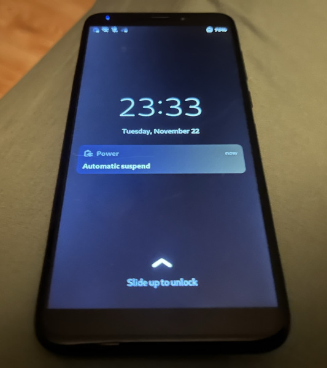

# Bugs:

Comments after 3 weeks full-time use. 
In general, everything works: calls, sms, mms, data, wifi, ... but here are the issues.

Tested first with revision 1.1 Braveheart, and lately **revision 1.2 3GB**. They seem to have the same issues however (if not mentioned otherwise). Also well-known issues with old rev 1.1 are not mentioned here (as they can be read about on that hardware revision page in wiki): such as USB-C did not work at all and power drain when turned off.

Latest **Mobian Phosh** was used, starting from **2022-10**. With modem firmware ADSP 01.003.01.003 and Pinephone Modem SDK.

## Bugs

Repetition of critical bugs (mentioned later):

1. Sound stops working from nowhere, probably on resume from suspend
2. Camera is gone 50% of the time
3. Compositor (?) crashes, screen is black and need to force restart
4. Also.. a few times it REBOOTED when I pressed answer call

#### General (GNOME / apps / asorted)

 **TODO** check or add these issues where applicable (?), like [Mobian](https://salsa.debian.org/Mobian-team/devices/pinephone-support/-/issues) or [GNOME](https://gitlab.gnome.org/GNOME) apps.

1. mute doesn't work in calls!! \
**issue up:** it is only for SIP calls (i.e. on 3G and 4G?) -> https://gitlab.gnome.org/GNOME/calls/-/issues/395
2. at boot, cellular network is off, although it is on in settings GUI. Need to manually turn Mobile Data off and on again.
3. ~~Virtual keyboard, except for "terminal" other keyboard layouts interpret some combinations as commands, e.g. SHIFT+c => backspace, not capital C (!).~~ \
**Edit:** This only applies for Signal-Desktop, not rest of apps! (mentioned again in Signal section below)
5. **VERY ANNOYING!** Sound (input and output) is sometimes completely dead (need to restart phone or, sometimes, just Pulseaudio is enough) (when trying to play a sound it then says _"Failed to create sink input: sink is suspended"_) \
~~**Test 1:**  use Pipewire globally (as mentioned in README.md)~~ -> No did not fix this issue \
~~**Test 2:** `sudo apt remove wireplumber` (and revert change from above), this should use pipewire-media-session (recommendation from IRC).~~ -> No, similarily it might stop working, although now when it doesn't work the volume bar is not visible at all (why?) this at least makes it easier to know when it's not working. However, with a downside: for some reason it is not possible to change the volume in phone calls anymore (this is not necessarily a big deal but wtf). \
**Further issue:** Sometimes when doing a warm reboot to fix the issue, the phone cannot boot: it vibrates with blinking red light and gives up. Cold start boots.
7. Turning off wifi in settings and on again, does not find any wifi networks until system reboot. This happens ~~everytime~~ sometimes (I don't understand when it works or when it does not work!). Also sometimes it can see wifi networks but not able to connect? Just reboot the phone..
8. LED is often blinking but unclear why, where is notification? **I think the issue is** that you get a notification which just says something like "entering suspend". The issue is mentioned again in next section with a picture example.
9. Notifications doesn't keep time: if you get a notification and suspend for X hours, it will just say you just got a notification 1m (or w-e) ago on screen. i.e., suspended time is not counted.
10. After pairing Bluetooth headphones, how to play sound there and not speakers?
11. **Warning:** Ringtone plays from headphones if connected, this is can be loud (depending on current volume setting). Alarm and other apps might also be loud!!! At the least, it can be annoying while you're in a call.
12. ~~During calls, the screen blanks often (easy fixable?).~~ \
**Comment:** This issue is not _that_ bad anymore, keep an eye on it (I think I've seen this mentioned somewhere).
12. I couldn't copy phone number from contacts, ctrl+c / copy did not work? Is it even possible to copy a contact nr and share via SMS?
13. Minor annoyance: there is some kind of airplane mode in settings (unclear if it actually does something or just reaction to wifi+BT off), with it, cellular network is still on but you can't access the settings. Just turn it off and then manually turn off BT and wifi .. again.

#### Pinephone specific

13. Phone calls; Some minor electrical noise is annoying (but usable), I mostly use 4G calls. Recommended to use headphones: Speaker phone is garbage (echo!), regular call is OK but can echo a lot too (!), headphones works well.
14. ~~on low and moderate brightness settings, screen blinks and can even be completely black! Due to low battery? Random?~~ \
**Fixed:** This has not happened again on rev 1.2?
15. ~~**What?!** wifi hw switch doesn't work when device is already on (i.e. wifi is always "on").~~ (mentioned more below) \
**Comment:** Seemingly only on rev 1.1 and not 1.2, but I do not trust it!
17. **VERY ANNOYING!** Screen sometimes blank (and/or more rarely applications are gone when trying to wake it). Sound still works.
18. **ANNOYING** Like 50% of the time, the camera is not discovered and need to reboot. Megapixel app says says that "_Could not open /dev/video2: No such device or address_" (sometimes it says /dev/video1 instead).
19. You can use the phone as a desktop computer (HDMI screen, USB peripherals etc.) via USB-C dock. USB-C usually works (phone rev 1.2), but sometimes it doesn't detect the (USB, HDMI, ..) devices. Specifically, USB-C stopped working and I needed to reboot and remove battery. To reproduce; connect USB periherals, disconnect and then reconnect the cable - in these cases usb seems to stop working until reboot (removal of battery necessary or coincidence?). \
**TODO check if this is only when Pine Keyboard is attached as this is known issue (?)**.
21. Somewhat often (<=50%), GPS does not work at all. When it does work it has low accuracy (mentioned later).

#### Pinephone Keyboard specific

The attachable keyboard adds roughtly 3x (+200%, 6000mAh) battery life and it's a keyboard. Nice.

1. upower reports 3 batteries instead of 2 when using Pinephone (hardware) keyboard. Additionally, battery detection seems unstable, and sometimes reports keyboard as 0% power.
2. _(fixable [1])_ The layout is peculiar, specifically it is very annoying to write with Swedish layout (öä).
3. _(fixable [1])_ The special buttons to write symbols such as `|` `-` `_` stopped working, probably related to keyboard choosen in OS?
4. _(battery detection)_ It reports 1-2 extra batteries (`upower -d` or settings) which decreases the calculated battery percentage (100%+100%+0%+0% = 50% battery left).
5. _(battery detection)_ In general the phone does not detect the size of the batteries, so it ignores that the keyboard battery is twice the size as the internal when calculating remaining battery percentage.
6. _(battery detection)_ Sometimes it temporarily loses contact (or something) and reports keyboard battery as 0%. The keyboard still works however.

[1] - afaik you can reprogram the firmware in the keyboard (https://xnux.eu/log/#044) and do really what you'd want. Also you can change the keyboard mapping in OS.

#### Rare bugs

0. When calling, sometimes/some (?) voicemails have no sound (this time using 4G, VoLTE, if relevant), i.e. you get a tone but when connected it's all silent. Calls in general seem to work.
1. Like once, on new boot the top drag-down menu didn't work. Fixed by locking phone. Also lower drag-down menu can bug when turning phone to landscape mode and having the menu up (it won't go away), to fix lock phone or close the menu in portrait mode (easy).
2. At least two times [1]: I answered a call and the phone continued to vibrate and then the whole system crashed (rebooted).
3. At least once it has just rebooted suddently. And once I left it on charge and when I came back it was completely turned off. [1]
4. At least twice, modem was dead on wake from suspend, although it could have occured earlier of course. [1]

[1] - To be clear, this was 2022-11, rev 1.2. (pinephone-modem-sdk and ADSP 01.003.01.003)

## Bugs - extended notes

1. **i)** Sometimes sound stops working (both speakers and headphones). Why? _Sometimes_ it is fixed by rebooting, _sometimes_ it is fixed by issuing `systemctl --user restart pulseaudio`. Hardware issue or bad connection seems unlikely. Pulseaudio fails with: _"Failed to create sink input: sink is suspended"_. Usually it stops working after resume from suspend, but sometimes, rarely, not even a reboot fixes it. \
**ii)** ~~music often pauses or interrupts when headphone cord is pulled a little, this is annoying. _**Edit:** Now it just worked perfectly for 2h, also ok power drop 15% per hour listening to music in flight mode._~~ \
**Comment:** PipeWire did not fix these issues (but I guess it didn't hurt) \
**Comment:** ii) has worked lately (rev 1.2, nov 2022), keep an eye on it. i) remains!

2. ~~Sometimes when wake from suspend? And if you manually turn off mobile data or mobile network, often when turned on internet does not work. Sometimes no data, sometimes neither data or cellular. Setting Network gives error, "Cannot register modem: modem is c..." and changing Network Mode says "Transaction timed out" _or_ "Setting allowed modes not supported". Restarting ModemManager or NetworkManager does not help. Is there a solution? (usually cellular looks to work "4G", but no internet)~~ Mostly fixed with modem sdk and new firmware. Still sometimes, modem disappears completely when waking from suspend (and similar problems?).

3. **Only on rev 1.1 I think? Still very strange!**. Wifi off switch ("killswitch") doesn't _really_ work! If I turn it off when running, I still have internet (yes it was routing via wifi) and bluetooth. It worked to disable wifi before, as I recall, but now I tried twice and it just keeps going. If I turn it off before booting, it remains off however. (But evidently it still has connection and power?) [1]

4. Bad sound quality on 4G, it's OK but a lot (but not too loud) of digital background noise. Acceptable but minor pain in the ears. Echo likely when not using headphones.

5. Sometimes screen seems dead, when waking from suspend the screen is blank! You can still hear the sound from the volume buttons, for example. ~~Maybe when it's doing a lot in the background?~~ Sometimes it is resolved by waiting a minute, but when working again all apps are killed. Or that you don't notice anything, but all apps are just closed after unlocking screen. Perhaps Wayland just crashed?

6. Notification light sometimes blink randomly when off, and you may also see a notification on the screen. [2]

[1] - \
 \
(the ping is not 780 ms but like 30.780 ms, bad pic)

[2] - \

# Feature Questions/Requests

1. Import/export contacts from SIM card? (contacts can be handled via .vcf file instead)
2. ~~How to get VoLTE to work, if it doesn't out of the box? (I didn't work for me)~~ \
**Answer:** For me, installing [Pinephone Modem SDK](https://github.com/the-modem-distro/pinephone_modem_sdk) solved 4G issues, see section in README.md
4. Add shortcut / key combination for screenshot?

5. ~~Watch videos in browser without lag, HW acceleration?~~ \
**Partial answer:** I think no hw acceleration in browsers since Mali400 MP2, it only supports GLES 2.0. Use local players if possible, like MPV. Edit, I think it's not as bad as I first thought, as long as there is enough ram, 360p video (incl. livestreams) should at least kind of work (with the downside that it uses a lot of battery due to no hw acc).

6. Record videos? 
**Partial answer:** haven't seen any app/GUI but ffmpeg should work at least. Yes, ffmpeg should work but it is supposedly bad quality). **I guess you can't have video calls?**
8. How to improve GPS? Is GPS working or using IP geolocation (https://wiki.gnome.org/Apps/Maps/Geolocation)? \
**Status:** I usually get 50-150m accuracy with new firmware and modem sdk. But not better. \
**TODO:** see e.g. https://wiki.mobian-project.org/doku.php?id=location#setup-gpsd, https://wiki.pine64.org/wiki/PinePhone#GPS_/_GNSS, https://wiki.mobian-project.org/doku.php?id=location
9. Is it possible to turn on wifi HW switch during runtime and connect to wifi without reboot? ... Unload and load the kernel module? Probably bad for the hw? Wifi killswitch doesn't work for me if I turn it off while system is running!!
10. ~~How to reliably listen to music, especially while not draining battery too much?~~ Whatever it works OK. \
~~Playing music and pausing via lockscreen almost works (not too reliable? It pauses sometimes? See sound issue, maybe just hw issue).~~ (For last part, use PipeWire)
12. How does suspend work? e.g. Running cronjobs, systemd timers, watch-dog checking Signal-desktop messages possible etc? (Sure it's just regular 'systemctl suspend'?)
13. Connecting phone to external "highres" monitor (e.g. 1080p, 1440p) is so damn slow! Completely unusable really. Should have hw acc or no? \
**Partial answer:** there is supposedly hw acc with GTK4 but not with GTK3. Someone suggested that Phosh uses GTK3, so use e.g. sxmo (GTK4) to utilize hw acc in UI components. (But still it will probably be slow?) \

# Apps (that have issues)

## Signal-desktop

It works but might be annoying.

0. **VERY ANNOYING!** When adding attachments (or get other pop ups), the keyboard no long writes into signal text box, restart the app fixes it.
1. With regular (virtual) keyboards capital letters seem to work, _except_ shift+c which removes the letter prior (like backspace)! This applies for multiple keyboard languages, but "terminal" (virtual) keyboard works.
2. It's a bit difficult to build Signal-Desktop. TODO, fix build so it is packaged as .deb instead of binary, and make it work on other versions than the one tested. ~~Or at least add a shortcut so it is easy to launch said binary (how?)~~. \
**Partial answer:** to add shortcut is explained in [README.md](https://github.com/Eliot-Roxbergh/notes_pinephone#install) (look there for how to build Signal)
4. ~~TODO try to collapse side menu with mouse?~~ \
**Answer:** It's possible to collapse side menu with mouse (drag) which makes it easier to use, connect mouse via usb-c hub for instance.
6. ~~It is possible to send and receive pictures, but they look very small and blurry (when ui zoomed out max). Need to save them on disk to see clearly.~~ \
**Answer:** tap once to zoom in
