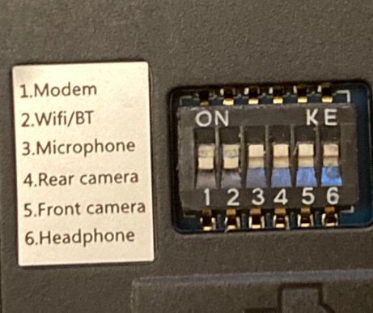

# Bugs:

Most of this was for my test phone which is old revision 1.1 Braveheart! But revision ~1.2, 3GB version, seem to have mainly the same issues (although it should now work with USB-C and no power drain when turned off) 

## Bugs

#### General (GNOME / apps / asorted)
- mute doesn't work on calls!! \
**issue up:** it is only for SIP calls (i.e. on 3G and 4G?) -> https://gitlab.gnome.org/GNOME/calls/-/issues/395
- Phone calls; Some minor electrical noise is a minor annoyance (I mostly use 4G). Recommended to use headphones: Speaker phone is garbage (echo!), regular call is OK but can echo a lot too (!), headphones works well.
- at boot, cellular network is off, although it is on in settings GUI. Need to turn Mobile Data off and on again.
- upower reports 3 batteries instead of 2 when using Pinephone (hardware) keyboard.
- Virtual keyboard, except for "terminal" other keyboard layouts interpret some combinations as commands, e.g. SHIFT+c => backspace, not capital C (!).
- **VERY ANNOYING!** Sound (input and output) is sometimes completely dead (need to restart phone or, sometimes, just Pulseaudio is enough) **TODO** add/check here https://salsa.debian.org/Mobian-team/devices/pinephone-support/-/issues. (when trying to play sound it then fails with _"Failed to create sink input: sink is suspended"_)
- Turning off wifi in settings and on again, does not find any wifi networks until system reboot.
- Notifications doesn't keep time: if you get a notification and suspend for X hours, it will just say you just got a notification 1m (or w-e) ago on screen. i.e., suspended time is not counted.
- After pairing Bluetooth headphones, how to play sound there and not speakers?
- Ringtone plays from headphones if connected, this is LOUD. Dangerous??

#### Pinephone specific

- ~~on low and moderate brightness settings, screen blinks and can even be completely black! Due to low battery? Random?~~ This has not happened again on rev 1.2?
- **What?!** wifi hw switch doesn't work when device is already on (i.e. wifi is always "on").
- LED is often blinking but unclear why, where is notification? Also sometimes I get notification which just says it should enter suspend now?
- **VERY ANNOYING!** Screen sometimes blank (and/or more rarely applications are gone when trying to wake it). Sound still works.
- Calling issues, screen blanks often (easy fix?), somewhat poor 4G call sound, calling someone's voice mail sometimes quiet.
- **ANNOYING** Like 50% of the time, the camera is not discovered and need to reboot. (_Could not open /dev/video2: No such device or address_)
- USB-C usually works (phone rev 1.2), but sometimes it doesn't detect the (USB, HDMI, ..) devices. Yes you can use the phone as a computer (HDMI screen, USB peripherals etc.). Although it is amazingly slow in 1440p. However, the clear bug here is that sometimes USB-C stops working and I needed to reboot and remove battery. ~~Is this related to using the attachable Pine keyboard?~~ To reproduce; connect USB periherals, disconnect and then reconnect the cable - in these cases usb seems to stop working until reboot (removal of battery necessary or coincidence?). I think the problem is the same regardless if Pine keyboard is attached or not.

#### Pinephone Keyboard specific

The attachable keyboard adds roughtly 3x (+200%, 6000mAh) battery life and it's a keyboard. Nice.

- _(fixable [1])_ The layout is peculiar, specifically it is very annoying to write with Swedish layout (öä).
- _(fixable [1])_ The special buttons to write symbols such as `|` `-` `_` stopped working, probably related to keyboard choosen in OS?
- _(battery detection)_ It reports 1-2 extra batteries (`upower -d` or settings) which decreases the calculated battery percentage (100%+100%+0%+0% = 50% battery left).
- _(battery detection)_ In general the phone does not detect the size of the batteries, so it ignores that the keyboard battery is twice the size as the internal when calculating remaining battery percentage.
- _(battery detection)_ Sometimes it temporarily loses contact (or something) and reports keyboard battery as 0%. The keyboard still works however.

[1] - afaik you can reprogram the firmware in the keyboard (https://xnux.eu/log/#044) and do really what you'd want. Also you can change the keyboard mapping in OS.

#### Rare bugs

0. When calling, sometimes/some (?) voicemails have no sound (this time using 4G, VoLTE, if relevant), i.e. you get a tone but when connected it's all silent. Calls in general seem to work.
1. Like once, on new boot the top drag-down menu didn't work. Fixed by locking phone. Also lower drag-down menu can bug when turning phone to landscape mode and having the menu up (it won't go away), to fix lock phone or close the menu in portrait mode (easy).
2. When I answered a call the phone continued to vibrate and then the whole system crashed (rebooted).
3. Once I left it on charge and when I came back it was completely turned off.

## Bugs - extended notes

1. **i)** Sometimes sound stops working (both speakers and headphones). Why? _Sometimes_ it is fixed by rebooting, _sometimes_ it is fixed by issuing `systemctl --user restart pulseaudio`. Hardware issue or bad connection seems unlikely. Pulseaudio fails with: _"Failed to create sink input: sink is suspended"_ \
**ii)** ~~music often pauses or interrupts when headphone cord is pulled a little, this is annoying. _**Edit:** Now it just worked perfectly for 2h, also ok power drop 15% per hour listening to music in flight mode._~~ \
**Comment:** PipeWire did not fix these issues (but I guess it didn't hurt) \
**Comment:** ii) has worked lately (rev 1.2, nov 2022), keep an eye on it. i) remains!

2. ~~Sometimes when wake from suspend? And if you manually turn off mobile data or mobile network, often when turned on internet does not work. Sometimes no data, sometimes neither data or cellular. Setting Network gives error, "Cannot register modem: modem is c..." and changing Network Mode says "Transaction timed out" _or_ "Setting allowed modes not supported". Restarting ModemManager or NetworkManager does not help. Is there a solution? (usually cellular looks to work "4G", but no internet)~~ Mostly fixed with modem sdk and new firmware. Still sometimes, modem disappears completely when waking from suspend (and similar problems?).

3. Wifi off switch ("killswitch") doesn't _really_ work! If I turn it off when running, I still have internet (yes it was routing via wifi) and bluetooth. It worked to disable wifi before, as I recall, but now I tried twice and it just keeps going. If I turn it off before booting, it remains off however. (But evidently it still has connection and power?) \
 \
(the ping is not 780 ms but like 30.780 ms, bad pic) \

4. Bad sound quality on 4G, it's OK but a lot (but not too loud) of digital background noise. Acceptable but minor pain in the ears. Echo likely when not using headphones.

5. Sometimes screen seems dead, when waking from suspend the screen is blank! You can still hear the sound from the volume buttons, for example. ~~Maybe when it's doing a lot in the background?~~ Sometimes it is resolved by waiting a minute, but when working again all apps are killed. Or that you don't notice anything, but all apps are just closed after unlocking screen. Perhaps Wayland just crashed?

# Feature Questions/Requests

1. Import/export contacts from SIM card? (contacts can be handled via .vcf file instead)
2. ~~How to get VoLTE to work, if it doesn't out of the box? (I didn't work for me)~~ \
**Answer:** For me, installing [Pinephone Modem SDK](https://github.com/the-modem-distro/pinephone_modem_sdk) solved 4G issues, see section in README.md
4. Add shortcut / key combination for screenshot?

5. ~~Watch videos in browser without lag, HW acceleration?~~ \
**Partial answer:** I think no hw acceleration in browsers since Mali400 MP2, it only supports GLES 2.0. Use local players if possible, like MPV. Edit, I think it's not as bad as I first thought, as long as there is enough ram, 360p video (incl. livestreams) should at least kind of work (with the downside that it uses a lot of battery due to no hw acc).

6. Record videos? _(haven't seen any app/GUI but ffmpeg should work at least)_. Have video calls ? _(Theoretically possible, but probably not / not fast enough?)_
7. How to improve GPS? Is GPS working or using IP geolocation (https://wiki.gnome.org/Apps/Maps/Geolocation)? \
**Status:** I usually get 50-150m accuracy with new firmware and modem sdk. But not better. \
**TODO:** see e.g. https://wiki.mobian-project.org/doku.php?id=location#setup-gpsd, https://wiki.pine64.org/wiki/PinePhone#GPS_/_GNSS, https://wiki.mobian-project.org/doku.php?id=location
9. Is it possible to turn on wifi HW switch during runtime and connect to wifi without reboot? ... Unload and load the kernel module? Probably bad for the hw? Wifi killswitch doesn't work for me if I turn it off while system is running!!
10. How to reliably listen to music, especially while not draining battery too much? ~~Playing music and pausing via lockscreen almost works (not too reliable? It pauses sometimes? See sound issue, maybe just hw issue).~~ (For last part, use PipeWire)
11. How does suspend work? e.g. Running cronjobs, systemd timers, checking Signal-desktop messages possible etc? (Sure it's just regular 'systemctl suspend'?)
12. Connecting phone to external "highres" monitor (e.g. 1080p, 1440p) is so damn slow! Should have hw acc or no?

## Apps (that have issues)

#### VLC
Works to play music, even while phone is locked/screen off, and controlling music via lockscreen works as well (but other apps also work). 
Probably give up and try to use "native" apps like Lollypop, vlc is made for desktop.

1. Bad UI for phone, but it works

#### Signal-desktop

It works but might be annoying.

0. **VERY ANNOYING!** When adding attachments (or get other pop ups), the keyboard no long writes into signal text box, restart the app fixes it.
1. Fix build so it is packaged as .deb instead of binary. Or at least add a shortcut so it is easy to launch said binary (how?). (See seprate file on building signal)
2. ~~TODO try to collapse side menu with mouse?~~ It's possible to collapse side menu with mouse which makes it easier to use.
3. It is possible to send and receive pictures, but they look very small and blurry (when ui zoomed out max). Need to save them on disk to see clearly.
4. With regular (virtual) keyboards capital letters seem to work, _except_ shift+c which removes the letter prior (like backspace)! This applies for multiple keyboard languages, but "terminal" (virtual) keyboard works.

#### Firefox

Bad UI for small screens, might reconsider. Consumes quite a lot of ram, but usable.

Is there a phone configuration, or similar, available? Otherwise cannot really recommend.

1. How to change or list bookmarks? Such things are very unclear.
